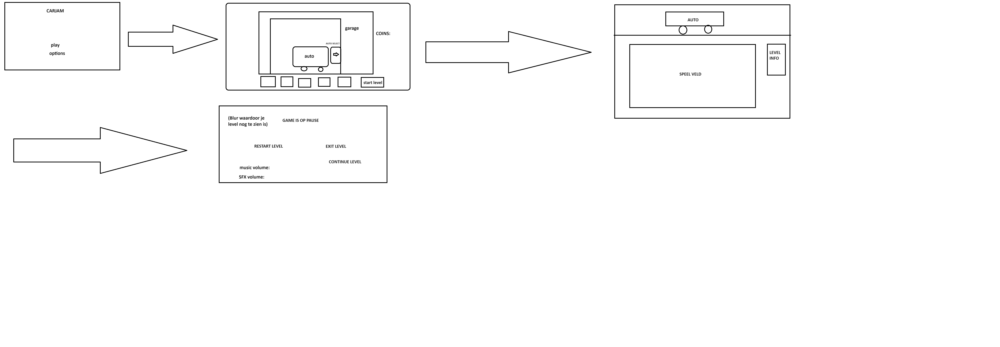

# Eerste Product review blok 2 Sprint 1.

## K2 Je hebt de behoeftes van de doelgroep onderzocht en gebruikt om zelf een aantal user stories te schrijven. 
Wij hebben user stories toegevoegd aan de hand van een paar resultaten van het interview wat we hebben gedaan. user stories die wij hebben toegevoegd zijn: voeg muziek/soundeffects toe, voeg meerdere levels toe aan het spel en voeg een main menu toe waar je alle levels kan toevoegen. deze 3 user stories zorgen er voor dat de speler een betere ervaring heeft tijdens het spelen van het spel.

## K3 Je hebt de gebruikersinterface van jouw product aangepast door prototyping toe te passen 

## K4 Je hebt een testplan geschreven en gebruikt om een gebruikerstest uit te voeren.

Wij hebben een schets gemaakt op basis van de verschillende schermen van onze game. Deze schets zag er als volgt uit. 

  