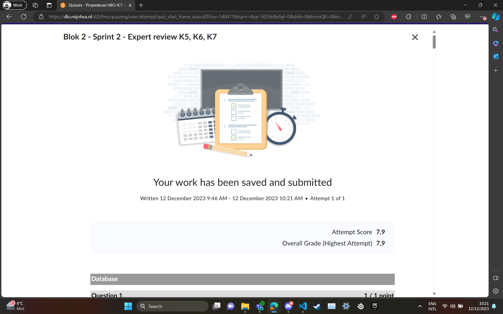
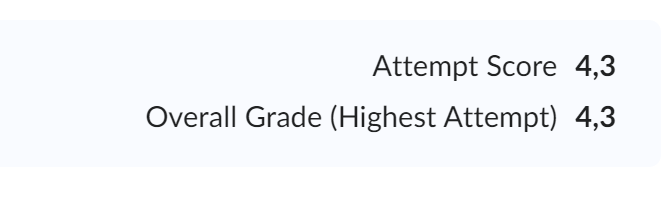

# Expert review sprint 2: toets over OOP, SQL en UML

## Foto's toetsresultaat

 

 

## K5 Je hebt object georiënteerd geprogrammeerd en maak gebruik van objectgeoriënteerde technieken zoals abstraction, inheritance en encapsulation.

Tijn: wat gaat goed: OOP ging goed, classes begrijp ik beter dan eerst en abstraction, inheritance en encapsulation gingen ook redelijk
wat kan beter: het werken met classes kan sneller, en mijn begrip over classes kan nog verder uitgebreid worden.

Rick:  Wat gaat goed: Met classes heb ik gelukkig al gewerkt in het vorige blok. dit zorgt er voor dat ik een redelijk begrip heb over hoe ik met deze moet werken.
Wat kan beter: OOP kan beter maar gaat wel de goede kant op, ik ben rustig aan bezig met het begrijpen van dingen zoals encapsulation, abstraction en inheritance.

## K6 Je hebt een genormaliseerde relationele database ontworpen en gebruikt om informatie uit je project in op te slaan, op te halen en te bewerken.

Tijn: wat gaat goed: SQL syntax ging goed, en de basis van ERD was ook aanwezig
wat kan beter: ERD kennis was niet hoog genoeg om alle vragen goed te maken, en ingewikkelde SQL queries waren lastig

Rick: Wat gaat er goed: SQL gaat net zoals bij Tijn goed. ERD kan ook bij mij iets beter maar mijn grotendeelse begrip over de ERD is aanwezig. Ik moet daarintegen wel nog werken aan mijn meer complexe kennis van SQL zoals hoe exact 'joins' werken
## K7 Je hebt je werk beschreven met behulp van UML-technieken.

Tijn: wat gaat goed: De basis van inheritance in UML had ik onder de knie
wat kan beter: Class diagrammen naast inheritance vond ik lastig te lezen, dus hier meer onderzoek naar doen en zelf maken

Rick: Wat kan beter: na de toets heb ik gemerkt dat de UML-technieken nog niet helemaal onder de knie zijn bij mij. ik heb hier nog moeite mee aan alle aspecten en weet dan ook dat ik hier in de komende weken aan moet werken.