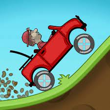
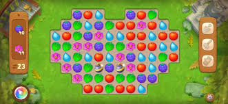
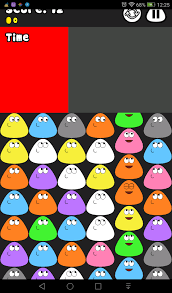
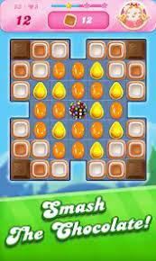
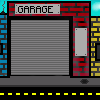
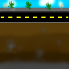
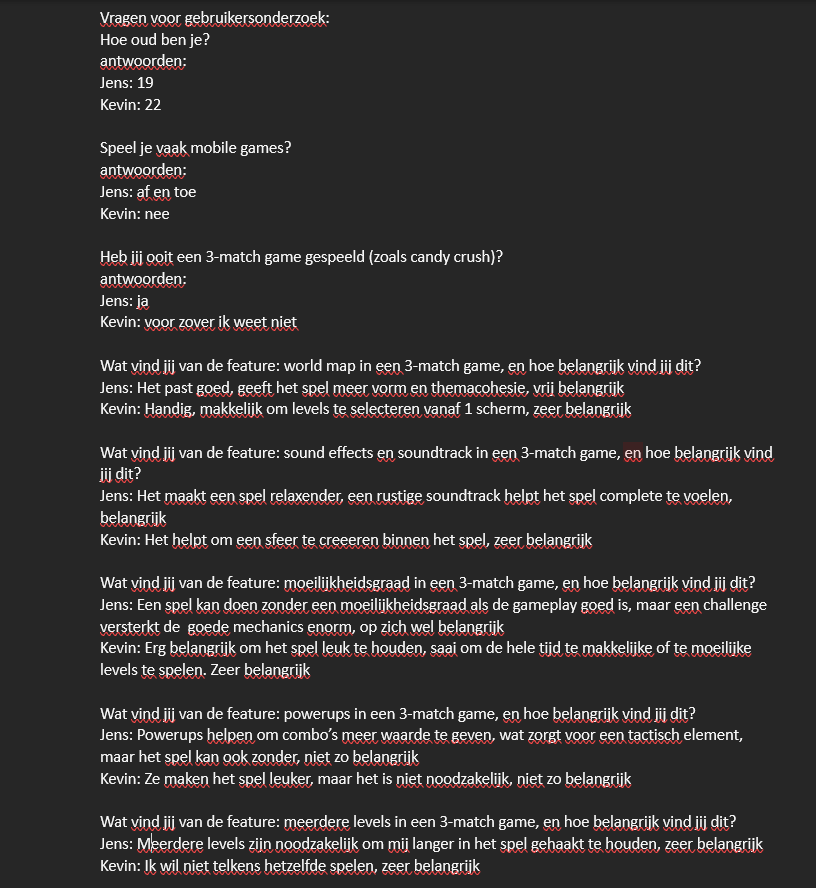

# Eerste Product review blok 2 Sprint 2.

## K2 Je hebt de behoeftes van de doelgroep onderzocht en gebruikt om zelf een aantal user stories te schrijven. 

### Inspiratie voor de game:
Wij hebben voor dit onderdeel van de product review gemaakt door alles op te delen in 4 stukken, deze stukken zijn: Inspiratie voor art style van de game, inspiratie van de game zelf, Inspiratie voor de style van de game (icoontjes,achtergrond,naam etc.). Inspiratie voor muziek/soundtrack

### Inspiratie voor art style van de game:
De inspiratie voor de art style van de game is zeer pixelated. Hier is niet echt perse een specifiek voorbeeld voor aangezien niet heel veel match 3 spellen zijn gemaakt met deze style spel. De reden waarom we de keuze hebben gemaakt om met pixel art te werken is omdat we daar meer verstand van hadden dan andere art styles.

### Inspiratie van de game zelf:
De inspiratie voor de game zelf is gebasseerd op spellen zoals Candy Crush en Gardenscapes. Dit zijn 2 match 3 spellen die allebij de zelfde werking hebben. Dit zorgde er ook voor dat wij deze 2 spellen als inspiratie hebben gebruikt voor de algemene werking van het spel.

### Inspiratie van de style van de game:
De grootste inspiratie bron voor de style van de game is Hill Climb racing. veel van deze game komt dan ook voor in de game die wij aan het maken zijn. zo zijn de icoontjes in hill Climb Racing een inspiratie voor de icoontjes die wij matchen in onze game. En zorgen de auto's voor de inspiratie die wij hebben gebruikt om de auto boven in je scherm te implementeren in het spel.

### Inspiratie voor de sound effects en soundtrack
Voor de sound design hebben wij gekeken naar verschillende games die vergelijkbare thema's of gameplay gebruiken. Hieronder vallen de game Hill Climb Racing, Gardenscapes, Pou en Candy Crush. Hill climb racing is een autospel waarin je naar voren moet rijden in een vast gegenereerd level om zo meer geld op te halen, meer maps te unlocken en betere auto's te kopen. De soundtrack hierin geeft roadtrip vibes, het flowt goed en er zit een loop in. De muziek veranderd per menu, maar niet per level. De menumuziek geeft ons een goed basisritme om op voort te werken. De levelmuziek gaat iets te snel voor een 3-match game, dus die laten wij buiterwege.

Gardenscapes is een van de bekenste 3-match games op de markt, gethemateerd door tuinattributen. De game is erg rustgevend, wat goed past bij de pacing en het thema van het spel. De game muziek geeft de speler het gevoel alsof hij/zij alle tijd heeft, wat ook de bedoeling is aangezien er geen tijdslimiet op een level zit. Voor de rest gebruikt gardenscapes veel powerups, en de sound effects die bij de powerups horen, geven een goed gevoel aan de speler.

Pou een cartoonachtig en een apart spel; je zorgt voor een klein wezentje, waarmee je onder andere minigames kan spelen. Een van deze minigames is een match game. De muziek en soundeffects van pou zijn vrij simpel, maar wel gepast bij de activiteit die de speler verricht. Wij waren hierdoor ook van plan om de muziek simpel te maken, en de soundeffects ook.

Als laatste hebben we Candy Crush. Bij deze game hebben we voornamelijk gekeken naar de sound effects van matches maken en de powerups. Deze waren ritmisch in de chaos van het spel, het was goed duidelijk wanneer er een powerup werd geactiveerd en ook wanneer een match werd gemaakt. Het geluid gaf directe feedback aan de speler, wat wij heel goed vonden. 

## K3 Je hebt de gebruikersinterface van jouw product aangepast door prototyping toe te passen 
Hier onder staan nog wat art pieces van de game die de achtergrond opmaken van de uiteindelijke game

 
 
Hier boven staat een gifje van hoe de game er uit ziet als je het opstart. dit laat de speler snel weten wat voor game het is en wat het thema van de game is aangezien een garage meestal wel er voor zorgt dat mensen een connectie maken met auto's.

 
 
Boven dit stukje text staat de achtergrond die je ziet als je het spel speelt. Dit zorgt er voor dat ons spel er minder saai en eentonig uitziet. deze achtergrond bestaat uit een weg waar de auto op zou staan die je doormiddel van matches maken verder zou laten kunnen rijden wat uiteindelijk je score wordt.

## K4 
We hebben in blok 1 een gebruikerstest uitgevoerd waar wij alle informatie uit hebben gehaald die wij nodig hebben om extra en goede user stories te schrijven. Dit blok hebben wij een gebruikersonderzoek uitgevoerd om de gemaakte user stories te bevestigen bij andere mensen. Dit hebben wij uitgevoerd bij onze broer. Jens, de broer van Tijn, is 19 jaar oud en Kevin, de broer van Rick, is 22 jaar oud.

 