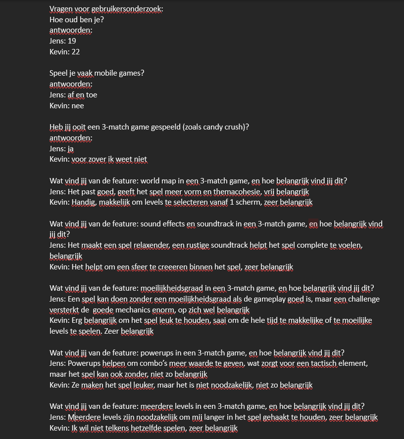
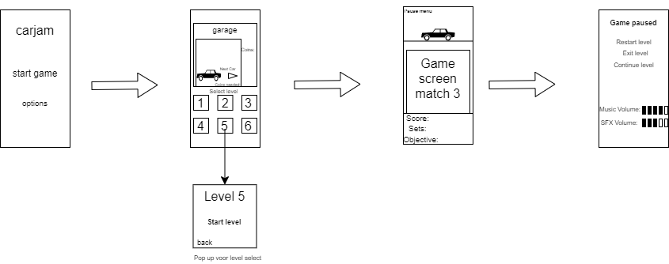

# Eerste Product review blok 2 Sprint 2.

## K2 Je hebt de behoeftes van de doelgroep onderzocht en gebruikt om zelf een aantal user stories te schrijven. 
We hebben in blok 1 een gebruikerstest uitgevoerd waar wij alle informatie uit hebben gehaald die wij nodig hebben om extra en goede user stories te schrijven. Dit blok hebben wij een gebruikersonderzoek uitgevoerd om de gemaakte user stories te bevestigen bij andere mensen. Dit hebben wij uitgevoerd bij onze broer. Jens, de broer van Tijn, is 19 jaar oud en Kevin, de broer van Rick, is 22 jaar oud.

 

## K3 Je hebt de gebruikersinterface van jouw product aangepast door prototyping toe te passen 
  

Wij gaan er van uit dat ze met K3 bedoelen dat je je spel heb gemaakt om het nagekeken concept, dus hier boven staat een foto van de schets die de beoordelers goed is gekeurd. Deze schets is hoe de game er uiteindelijk uit hoort te zien. Zoals te zien is in de volgende kriteria kan je zien dat deze schets een stuk meer gemaakt is omtrent telefoons. Dit zorgt er voor dat je makkelijk kan zien hoe het spel er uiteindelijk uit komt te zien.
## K4 Je hebt een testplan geschreven en gebruikt om een gebruikerstest uit te voeren.
Wij hebben deze sprint gewerkt aan de hand van de foto hieronder die aantoont hoe het spel uiteindelijk er uit moet zien. Natuurlijk is dit een erg
 