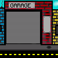

# Eerste Product review blok 2 Sprint 2.

## Inspiratie voor de game:
Wij hebben voor dit onderdeel van de product review gemaakt door alles op te delen in 4 stukken, deze stukken zijn: Inspiratie voor art style van de game, inspiratie van de game zelf, Inspiratie voor de style van de game (icoontjes,achtergrond,naam etc.). Inspiratie voor muziek/soundtrack

### Inspiratie voor art van de game:
De inspiratie voor de art style van de game

## K2 Je hebt de behoeftes van de doelgroep onderzocht en gebruikt om zelf een aantal user stories te schrijven. 
A

## K3 Je hebt de gebruikersinterface van jouw product aangepast door prototyping toe te passen 
Wij hebben deze sprint gewerkt aan de hand van de foto hieronder die aantoont hoe het spel uiteindelijk er uit moet zien. Natuurlijk is dit een erg brede illustratie van de game en is dit natuurlijk niet hoe het er uiteindelijk uit gaat zien aangezien wij nog heel wat art hebben gemaakt deze sprint.
 

Hier onder staan nog wat art pieces van de game die de achtergrond opmaken van de uiteindelijke game

 
Hier boven staat een gifje van hoe de game er uit ziet als je het opstart. dit laat de speler snel weten wat voor game het is en wat het thema van de game is aangezien een garage meestal wel er voor zorgt dat mensen een connectie maken met auto's.