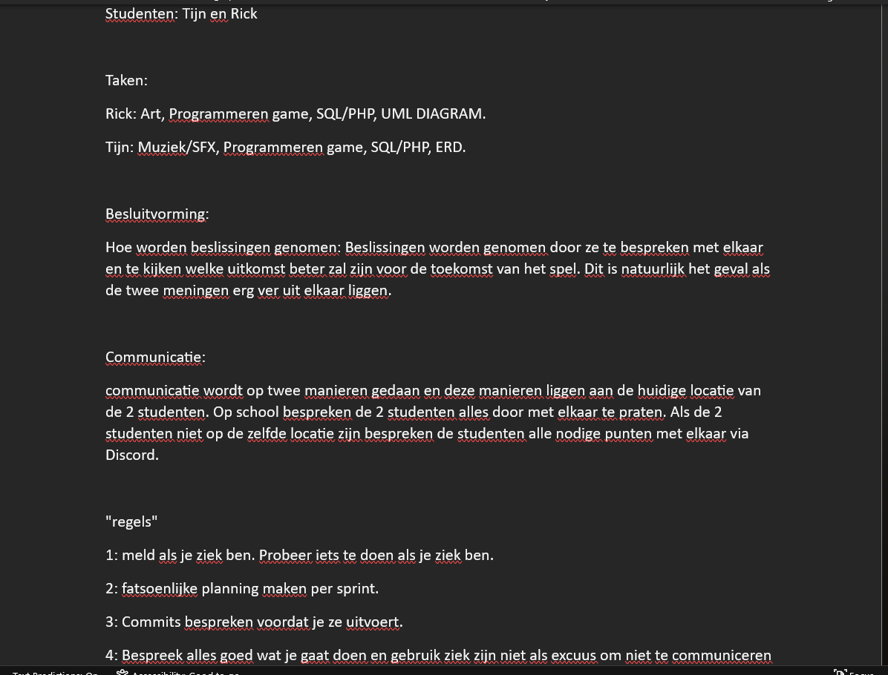

# Retrospective blok 2 Sprint 2.
In deze retrospective kijken we terug op de persoonlijke ontwikkeling, samenwerking en kwaliteit van het werk uit sprint 2.

## G1: Persoonlijke ontwikkeling.

### Je neemt verantwoordelijkheid voor je eigen handelen. Je aanvaardt consequenties van jouw gedrag. Je werkt resultaat gericht aan je opdracht of taak. Je hebt een actieve werkhouding. Je leert van en met elkaar en bent aanwezig op contactmomenten. Je herkent waar je leerbehoeftes zitten en stelt doelen op om deze te vervullen. Je reflecteert op je handelen en je evalueert je doelen.

Tijn: Doordat wij in sprint 1 veel hebben gekeken naar het concept, liep ik erg achter in de technische kant van het project. Het is moeilijk geweest om dit verschil in te halen in sprint 2, mede door mijn tekort aan discipline om extra tijd toe te wijden aan mijn kennis verbreden. Ik wil in de kerstvakantie een paar van mijn zwakke punten aanstippen. Dit zijn: het begrijpen van scope in JavaScript, het correct gebruiken van variables en functies in classes en een spoedcursus SQL om de database op te zetten. DIt ga ik doen door een verscheidenheid van video's te kijken, en referentiewebsites voor syntax. Ook ga ik op zoek naar manieren om discipline te verbeteren, door advies te zoeken op internet. Dit zal mij zowel op korte termijn als lange termijn helpen. Terugkijkend op retrospective 1 heb ik mijzelf voorgesteld om meer thuis te gaan werken, maar dit is er nauwelijks van gekomen, mede door deze slechte discipline die ik heb ten opzichte van schoolwerk. Door hiervoor concrete acties te nemen, zal dit mij hopelijk wel lukken deze sprint.

Rick: Net zoals Tijn al zij liepen wij na sprint 1 al achter en heb ik niet heel veel gedaan aan het spel in sprint 2. Ik merkte ook tijdens deze sprint dat ik mezelf niet heel erg heb bemoeit met het coderen aspect van het project. Ik was namelijk meer bezig met het art gedeelte van de game en ik merk dat ik mezelf erg nutteloos vond tijdens het maken van de art omdat ik eigenlijk alles liet doen door mijn medestudent. Ook iets wat ik merk is dat ik het doorzettingsvermogen mis om thuis te werken aan het project. dit is iets waar ik in de aankomende sprint/blokken erg aan moet en wil werken, dit zorgt er namelijk voor als ik het doorzettings vermogen heb dat ik meer aan mijn projecten kan werken en minder stress heb op school over het project doordat ik er ook thuis aan werk.

### Je geeft op constructieve manier feedback aan medestudenten en ontvangt feedback. Je geeft aan hoe je die feedback gaat gebruiken.

Tijn: Yanbo was naar mij toegekomen om ons een paar vragen te stellen over zijn game. Als eerste vroeg hij hoe de moeilijkheidsgraad is op het level? Ik vond zelf het level te makkelijk, maar dat was te verwachten aangezien dat het eerste level was. Daarnaast had ik gezegd dat het zou helpen om het speelveld kleiner te maken om zo het level iets uitdagender te maken. Vervolgens vroeg hij of ik geinteresseerd zou zijn om dit spel te spelen. Mijn antwoord was eigenlijk dat de mechanics van het spel mij wel zou interesseren om voor langere tijd te spelen, maar er moeten dan wel genoeg levels, en vooral genoeg (maar niet irritant veel) uitdaging zijn. Dit kon bereikt worden door mensen uit verschillende skillcategorieen de levels te laten testen. Als laatste vroeg Yanbo, hoe voelt het bewegen van de tiles over het scherm en de matches maken? Eigenlijk vond ik de movement en de matches near-perfect, en was hier dus vrijwel niks om op aan te merken.

## G4: Je werkt volgens (gegeven) kwaliteitsnormen

### Je werkt volgens de agile methodiek van HBO-ICT
De agile methodiek houdt in dat het werk wendbaar wordt gecreeerd zodat er nog aanpassingen in het proces kunnen worden gemaakt. Op deze school wordt gebruik gemaakt van de agile methode SCRUM. Met scrum wordt een project opgedeeld in (ongeveer gelijke) periodes, die srpints genoemd worden. Aan het einde van een sprint wordt gekeken naar het project en de werkwijze, waarna hierop aanpassingen gemaakt kunnen worden. Dit zorgt voor een soepel proces, waarbij een project op correcte manier zijn eindstadium kan halen. Aan het begin van de sprint wordt gekeken naar wat haalbaar lijkt voor de tijdsperiode die gegeven is. Aan het einde van de sprint wordt alles wat niet gehaald is, direct meegenomen naar volgende sprint.


Zoals te zien in het plaatje hierboven, is er gewerkt met een issue board in sprint 2. Uiteindelijk is maar 1 van de 3 user stories bijna af gekomen, en worden de andere twee, die in user story-doing staan, meegenomen naar de laatste sprint. Achteraf gezien hadden we onze planning specifieker kunnen maken. Door het gebruik van alleen maar een sprint planning, hebben wij geen tijdsgebonden acties vastgezet. Hierdoor hebben wij ons werk uitgesteld en zijn dus niet alle geplande user stories afgerond.

Het laatste onderwerp van de scrum-methode is de product review en de retrospective (het bestand wat nu gelezen word). In de product review wordt gekeken naar een testbaar product, zodat hier realistische feedback om gegeven kan worden. Onze product review was een presentatie over inspiratiebronnenanalyse, gebruikersonderzoek en prototyping. Wij hadden een te laag niveau prototye ontwikkeld, en hier kregen wij ook kritiek op, en de gebruikerstest kon nog wat werk gebruiken (zoals een grotere onderzoeksgroep nemen). Ons bronnenonderzoek was wel redelijk gewaardeerd. Hiervan hebben wij nogmaals geleerd dat wij onze aandacht meer op het project moeten focusen.

### Je code voldoet aan de Google coding conventions
Voor onze coding conventions kijken we naar een paar conventions die wij hanteren. Dit zijn:
- Naming conventions; dit helpt met het makkelijker begrijpen waar een variable, function of class voor dient. 
- Line length conventions: dit helpt met het makkelijker leesbaar maken van lange regels code, door de regel op te splitsen over verschillende regels of variablenamen korter te maken.
- Comments; deze helpen met het uitleggen wat een gecondenseerd stukje code doet, zodat teamsgenoten gemakkelijk begrijpen wat iemand anders van het team met een bepaald stukje code wilt bereiken.
- Indentation; deze helpt met een structuur geven aan een codeblok (zoals een if-statement). Hierdoor is het gemakkelijk om te bepalen wat er allemaal onder een statement valt.

```javascript
    //function that makes a tileMap, then loads an image for each respective tile
    #generateTileGrid() {

        const tileMap = [
            [4, 4, 4, 2, 3, 3],
            [4, 1, 1, 3, 2, 1],
            [2, 2, 3, 4, 1, 3],
            [3, 1, 3, 2, 3, 4],
            [1, 3, 3, 4, 4, 2],
            [2, 4, 2, 3, 1, 1]
        ]
        //tiles is a 2D array, meaning that it is an array of arrays. 
        //see https://www.freecodecamp.org/news/javascript-2d-arrays/ for more information about 2D arrays.
        this.#tiles = new Array();

        //generate tile grid here and place tiles in the 2D #tile array.
        for (let x = 0; x < this.#width; x++) {
            for (let y = 0; y < this.#height; y++) {
                if (!this.#tiles[x]) {
                    this.#tiles[x] = new Array();
                }

                const tileValue = tileMap[x][y];
                
                switch (tileValue) {
                    case 1:
                        this.#tiles[x][y] = new NormalTile(gameManager.getImage("Wheel"), this.#tileSize, x, y, 1);
                        break;
                    case 2:
                        this.#tiles[x][y] = new NormalTile(gameManager.getImage("SteeringWheel"), this.#tileSize, x, y, 2);
                        break;
                    case 3:
                        this.#tiles[x][y] = new NormalTile(gameManager.getImage("JerryCan"), this.#tileSize, x, y, 3);
                        break;
                    case 4:
                        this.#tiles[x][y] = new NormalTile(gameManager.getImage("StopSign"), this.#tileSize, x, y, 4);
                        break;
                }
            }
        }
    }
```

Om de naming conventions aan te tonen kijken we naar de variable tileValue en tileMap. De tileMap is een 2D array die aangeeft welke tilesoort er aan het begin van een level spawnt, zodat het altijd mogelijk is om aan het begin van het level een match te maken. De tileValue leest de waarde die op de bepaalde x en y-positie van de 2D array. Deze tileValue wordt vervolgens gebruikt om een bepaalde image in te laden, zodat het correcte plaatje laten zien wordt.

De line length convention wordt gebruikt door de switch-statement op te delen in 10 verschillende lines, zodat elke case van deze functie makkelijk leesbaar is zonder het bestand naar links en naar rechts te bewegen. 

De comment bovenaan de gehele for-loop laat zien waar de for-loop precies voor is; het creeeren van een tileGrid op het scherm aan de hand van de tileMap. Dit is ook precies wat er gebeurd in het gehele stukje code, dus de comment beschrijft goed wat er gebeurd.

De indentation wordt voornamelijk gebruikt in de switch-case functie. Door indentation is makkelijk te zien wanneer een bepaalde statement zich bijvoorbeeld in case 1 of in case 2 bevindt. Dit helpt met structuur geven aan het gehele stukje code.

### Je code is technisch gedocumenteerd en relevant voor collega's
Voor de technische documentatie gaan we verder kijken naar het bestand waar de #generateTileGrid zich in bevindt; dit is de tileGrid.js.
```javascript
class TileGrid {

    gridPosX;
    gridPosY;
    #tileSize;
    #tiles;
    #width;
    #height;

    //constructor that determines the size of every tile in the grid.
    constructor(width, height, tileSize) {
        this.#tileSize = tileSize;
        this.#width = width
        this.#height = height
        this.#generateTileGrid();
    }

    //function that makes a tileMap, then loads an image for each respective tile
    #generateTileGrid() {

        const tileMap = [
            [4, 4, 4, 2, 3, 3],
            [4, 1, 1, 3, 2, 1],
            [2, 2, 3, 4, 1, 3],
            [3, 1, 3, 2, 3, 4],
            [1, 3, 3, 4, 4, 2],
            [2, 4, 2, 3, 1, 1]
        ]
        //tiles is a 2D array, meaning that it is an array of arrays. 
        //see https://www.freecodecamp.org/news/javascript-2d-arrays/ for more information about 2D arrays.
        this.#tiles = new Array();

        //generate tile grid here and place tiles in the 2D #tile array.
        for (let x = 0; x < this.#width; x++) {
            for (let y = 0; y < this.#height; y++) {
                if (!this.#tiles[x]) {
                    this.#tiles[x] = new Array();
                }

                const tileValue = tileMap[x][y];
                
                switch (tileValue) {
                    case 1:
                        this.#tiles[x][y] = new NormalTile(gameManager.getImage("Wheel"), this.#tileSize, x, y, 1);
                        break;
                    case 2:
                        this.#tiles[x][y] = new NormalTile(gameManager.getImage("SteeringWheel"), this.#tileSize, x, y, 2);
                        break;
                    case 3:
                        this.#tiles[x][y] = new NormalTile(gameManager.getImage("JerryCan"), this.#tileSize, x, y, 3);
                        break;
                    case 4:
                        this.#tiles[x][y] = new NormalTile(gameManager.getImage("StopSign"), this.#tileSize, x, y, 4);
                        break;
                }
            }
        }
    }

    update(deltaTime) {
        //handle results from player input here...
    }

    //draw all the tiles
    draw() {
        for (let x = 0; x < this.#width; x++) {
            for (let y = 0; y < this.#height; y++) {
                if (!this.#tiles[x][y]) {
                    continue;
                }
                
                if (this.#tiles[x][y] && this.#tiles[x-1] && this.#tiles[x-1][y] && this.#tiles[x+1] && this.#tiles[x+1][y]) {
                    if (this.#tiles[x][y].tileType == this.#tiles[x+1][y].tileType && this.#tiles[x][y].tileType == this.#tiles[x-1][y].tileType) {
                        this.#tiles[x][y] = null
                        this.#tiles[x+1][y] = null
                        this.#tiles[x-1][y] = null
                    }
                }
                if (this.#tiles[x][y] && this.#tiles[y-1] && this.#tiles[x][y-1] && this.#tiles[y+1] && this.#tiles[x][y+1]) {
                    if (this.#tiles[x][y].tileType == this.#tiles[x][y+1].tileType && this.#tiles[x][y].tileType == this.#tiles[x][y-1].tileType) {
                        this.#tiles[x][y] = null
                        this.#tiles[x][y+1] = null
                        this.#tiles[x][y-1] = null
                    }
                }
                if (this.#tiles[x][y] != null)
                this.#tiles[x][y].draw();
            }
        }
    }

    //function that checks the position of a tile and returns it
    getTileAtPosition(position) {
        const gridXPosition = Math.floor(position.x / this.#tileSize);
        const gridYPosition = Math.floor(position.y / this.#tileSize);

        this.gridPosX = gridXPosition;
        this.gridPosY = gridYPosition;

        return this.getTileAtGridIndex(gridXPosition, gridYPosition);
    }

    //checks if a touchEvent is outside of the grid
    getTileAtGridIndex(x, y) {
        if (x < 0 || x >= this.#width || y < 0 || y >= this.#height)
        {
            throw new Error("index outside of bounds of grid!");
        }
        
        return this.#tiles[x][y];
    }

    //function that gives tiles a moving function
    getDraggingTile() {
        for (let x = 0; x < this.#width; x++) {
            for (let y = 0; y < this.#height; y++) {
                const tile = this.#tiles[x][y];
                if (tile.isDragging()) {
                    return tile;
                }
            }
        }
        return null;
    }

    swapTileIndex() {
        if (this.#tiles[x][y].gridPosX == this.#tiles[x+1][y].gridposX) {
            let temp = this.#tiles[x][y]
            this.#tiles[x][y] = this.#tiles[x+1][y]
            this.#tiles[x+1][y] = temp
        }
    }
}
```

Aan het begin worden alle class variablen gedefinieerd; dit zijn de x-positie en de y-positie van een tile in de grid (gridPosX en gridPosY), de grootte van de tile (#tileSize), een 2D array waar alle tiles zich in bevinden (#tiles), en nog de breedte en de hoogte van de tiles (#width en #height). Hierna wordt een constructor aangeroepen die elke tile een breedte, een hoogte en een grootte geeft, en ook nog de functie #generateTileGrid. In deze functie wordt eerst de tileMap gedefinieerd. Dit is een 2D array waar alle posities in de #tiles array een waarde krijgen die 1, 2, 3 of 4 is. Hierna wordt voor elke x en y in de tileMap, gecheckt of deze een waarde heeft van 1 t/m 4. Elke waarde krijgt een ander plaatje (wiel, stuur, benzinetank en verkeersbord). Hierna wordt de draw functie opgroepen. Hierin wordt voor elke tile in de #tiles array, gecheckt of hij bestaat of niet. Dit wordt gedaan omdat als een match wordt gevonden, worden de tiles die gematcht hebben een null waarde, en bestaan ze dus niet meer. De matches worden gecheckt door de waarde in de tileMap te checken links en rechts, of onder en boven van de tile waar de draw functie op dat moment langsgaat. In de getTileAtPosition wordt de locatie van elke tile op de grid gecheckt en geplaatst in een gridXPosition en gridYPosition variable. In de volgende functie wordt door de x en y-waarde van een mousePressed/touchEvent gecontroleerd of deze x en y buiten de tileGrid liggen. Als dit zo is, dan wordt er een error in de console geplaatst dat er buiten de grid een actie wordt uitgevoerd. De functie getDraggingTile() kijkt voor elke tile in de tileGrid of deze momenteel bewogen wordt. Als de functie aangeeft dat een tile bewogen wordt, dan wordt dit vervolgens doorgegeven aan de tile class om deze de correcte movement te geven. De laatste functie (swapTileIndex()) wordt momenteel nog niet gebruikt, maar de functionaliteit zal ervoor zorgen dat als een tile verplaatst wordt, dat de tile zijn plaats vervangt met de tile waar de andere tile naartoe bewogen wordt (en dus posities verwisseld). De gehele class zorgt ervoor dat alle tiles op de goede plek beginnen en met de correcte afbeelding laten zien worden. 

### Je communiceert professioneel en gestructureerd
Tijn: Voor communicatie tussen mij en Rick hebben wij exclusief gebruik gemaakt van Discord. Dit is een (video)chatplatform, waarmee gemakkelijk foto's en video's kunnen worden. Ook kunnen videooproepen gestart worden, en scherm delen is ook een optie. Daarnaast heb ik met leraren zo formeel mogelijk gecommuniceerd. Ook probeer ik mijn feedback zo construcief mogelijk te verwoorden, en wordt kritiek met open armen ontvangen, aangezien ik hierdoor kan groeien als persoon en als programmeur.

Rick: Net als Tijn al had vermeld communiceren wij buiten school alleen via het platform "Discord" hiermee kunnen wij code snippets delen

## G5: Je kan constructief samenwerken in een duo

### Samenwerkingscontract



### Wat doen wij als de samenwerking niet lekker verloopt?

Als de samenwerking niet goed verloopt, dan bespreken wij onze moeilijkheden en/of punten van kritiek met elkaar. Van hieruit proberen wij tot een concensus te komen, waar wij allebei weer mee overweg kunnen. Hiervan leren wij van elkaar, en zal onze samenwerking erop vooruitgaan.

### Verwachting van duopartner

Tijn: Ik verwacht van Rick dat hij doet wat hem aangewezen is in de sprintplanning. Ook verwacht ik van hem dat hij zich houdt aan alle regels omtrent het samenwerkingscontract. Daarnaast verwacht ik van hem dat hij zicht uitspreekt als dingen niet goed verlopen, zodat wij misschien samen tot een oplossing kunnen komen.


### Feedback aan duopartner

Tijn: Hoewel Rick deze sprint mooie art heeft gemaakt voor onze game, heeft hij eigenlijk niet zoveel gewerkt aan de gehele code (JavaScript, SQL). Ik wil dat hij dus meer helpt met het vormgeven van de game, en niet zozeer een minder belangrijk onderwerp als de graphic design van de game (hoewel dat wel belangrijk is, maar dan pas later in het project). Hij communiceert wel wanneer hij op school is, en wat hij gaat doen per les. Maar ook wat hij van mij wil/verwacht, en dat waardeer ik enorm.