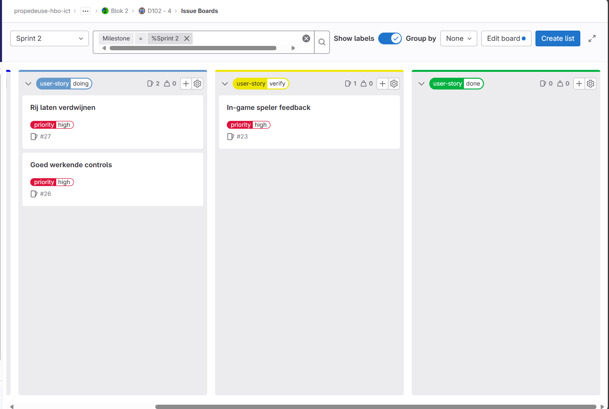
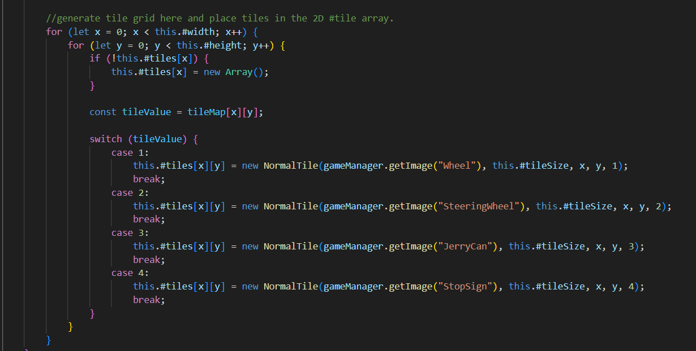

# Retrospective blok 2 Sprint 2.
In deze retrospective kijken we terug op de persoonlijke ontwikkeling, samenwerking en kwaliteit van het werk uit sprint 2.

## G1: Persoonlijke ontwikkeling.

### Je neemt verantwoordelijkheid voor je eigen handelen. Je aanvaardt consequenties van jouw gedrag. Je werkt resultaat gericht aan je opdracht of taak. Je hebt een actieve werkhouding. Je leert van en met elkaar en bent aanwezig op contactmomenten. Je herkent waar je leerbehoeftes zitten en stelt doelen op om deze te vervullen. Je reflecteert op je handelen en je evalueert je doelen.

Tijn: Doordat wij in sprint 1 veel hebben gekeken naar het concept, liep ik erg achter in de technische kant van het project. Het is moeilijk geweest om dit verschil in te halen in sprint 2, mede door mijn tekort aan discipline om extra tijd toe te wijden aan mijn kennis verbreden. Ik wil in de kerstvakantie een paar van mijn zwakke punten aanstippen. Dit zijn: het begrijpen van scope in JavaScript, het correct gebruiken van variables en functies in classes en een spoedcursus SQL om de database op te zetten. DIt ga ik doen door een verscheidenheid van video's te kijken, en referentiewebsites voor syntax. Ook ga ik op zoek naar manieren om discipline te verbeteren, door advies te zoeken op internet. Dit zal mij zowel op korte termijn als lange termijn helpen. Terugkijkend op retrospective 1 heb ik mijzelf voorgesteld om meer thuis te gaan werken, maar dit is er nauwelijks van gekomen, mede door deze slechte discipline die ik heb ten opzichte van schoolwerk. Door hiervoor concrete acties te nemen, zal dit mij hopelijk wel lukken deze sprint.

### Je geeft op constructieve manier feedback aan medestudenten en ontvangt feedback. Je geeft aan hoe je die feedback gaat gebruiken.

Tijn: Yanbo was naar mij toegekomen om ons een paar vragen te stellen over zijn game. Als eerste vroeg hij hoe de moeilijkheidsgraad is op het level? Ik vond zelf het level te makkelijk, maar dat was te verwachten aangezien dat het eerste level was. Daarnaast had ik gezegd dat het zou helpen om het speelveld kleiner te maken om zo het level iets uitdagender te maken. Vervolgens vroeg hij of ik geinteresseerd zou zijn om dit spel te spelen. Mijn antwoord was eigenlijk dat de mechanics van het spel mij wel zou interesseren om voor langere tijd te spelen, maar er moeten dan wel genoeg levels, en vooral genoeg (maar niet irritant veel) uitdaging zijn. Dit kon bereikt worden door mensen uit verschillende skillcategorieen de levels te laten testen. Als laatste vroeg Yanbo, hoe voelt het bewegen van de tiles over het scherm en de matches maken? Eigenlijk vond ik de movement en de matches near-perfect, en was hier dus vrijwel niks om op aan te merken.

## G4: Je werkt volgens (gegeven) kwaliteitsnormen

### Je werkt volgens de agile methodiek van HBO-ICT
De agile methodiek houdt in dat het werk wendbaar wordt gecreeerd zodat er nog aanpassingen in het proces kunnen worden gemaakt. Op deze school wordt gebruik gemaakt van de agile methode SCRUM. Met scrum wordt een project opgedeeld in (ongeveer gelijke) periodes, die srpints genoemd worden. Aan het einde van een sprint wordt gekeken naar het project en de werkwijze, waarna hierop aanpassingen gemaakt kunnen worden. Dit zorgt voor een soepel proces, waarbij een project op correcte manier zijn eindstadium kan halen. Aan het begin van de sprint wordt gekeken naar wat haalbaar lijkt voor de tijdsperiode die gegeven is. Aan het einde van de sprint wordt alles wat niet gehaald is, direct meegenomen naar volgende sprint.

Zoals te zien in het plaatje hierboven, is er gewerkt met een issue board in sprint 2. Uiteindelijk is maar 1 van de 3 user stories bijna af gekomen, en worden de andere twee, die in user story-doing staan, meegenomen naar de laatste sprint. Achteraf gezien hadden we onze planning specifieker kunnen maken. Door het gebruik van alleen maar een sprint planning, hebben wij geen tijdsgebonden acties vastgezet. Hierdoor hebben wij ons werk uitgesteld en zijn dus niet alle geplande user stories afgerond.

Het laatste onderwerp van de scrum-methode is de product review en de retrospective (het bestand wat nu gelezen word). In de product review wordt gekeken naar een testbaar product, zodat hier realistische feedback om gegeven kan worden. Onze product review was een presentatie over inspiratiebronnenanalyse, gebruikersonderzoek en prototyping. Wij hadden een te laag niveau prototye ontwikkeld, en hier kregen wij ook kritiek op, en de gebruikerstest kon nog wat werk gebruiken (zoals een grotere onderzoeksgroep nemen). Ons bronnenonderzoek was wel redelijk gewaardeerd. Hiervan hebben wij nogmaals geleerd dat wij onze aandacht meer op het project moeten focusen.

### Je code voldoet aan de Google coding conventions
Voor onze coding conventions kijken we naar een paar conventions die wij hanteren. Dit zijn:
- Naming conventions; dit helpt met het makkelijker begrijpen waar een variable, function of class voor dient. 
- Line length conventions: dit helpt met het makkelijker leesbaar maken van lange regels code, door de regel op te splitsen over verschillende regels of variablenamen korter te maken.
- Comments; deze helpen met het uitleggen wat een gecondenseerd stukje code doet, zodat teamsgenoten gemakkelijk begrijpen wat iemand anders van het team met een bepaald stukje code wilt bereiken.
- Indentation; deze helpt met een structuur geven aan een codeblok (zoals een if-statement). Hierdoor is het gemakkelijk om te bepalen wat er allemaal onder een statement valt.

Om de naming conventions aan te tonen kijken we naar de variable tileValue en tileMap. De tileMap is een 2D array die aangeeft welke tilesoort er aan het begin van een level spawnt, zodat het altijd mogelijk is om aan het begin van het level een match te maken. De tileValue leest de waarde die op de bepaalde x en y-positie van de 2D array. Deze tileValue wordt vervolgens gebruikt om een bepaalde image in te laden, zodat het correcte plaatje laten zien wordt.

De line length convention wordt gebruikt door de switch-statement op te delen in 10 verschillende lines, zodat elke case van deze functie makkelijk leesbaar is zonder het bestand naar links en naar rechts te bewegen. 

De comment bovenaan de gehele for-loop laat zien waar de for-loop precies voor is; het creeeren van een tileGrid op het scherm aan de hand van de tileMap. Dit is ook precies wat er gebeurd in het gehele stukje code, dus de comment beschrijft goed wat er gebeurd.

De indentation wordt voornamelijk gebruikt in de switch-case functie. Door indentation is makkelijk te zien wanneer een bepaalde statement zich bijvoorbeeld in case 1 of in case 2 bevindt. Dit helpt met structuur geven aan het gehele stukje code.

### Je code is technisch gedocumenteerd en relevant voor collega's

### Je communiceert professioneel en gestructureerd

## G5: Je kan constructief samenwerken in een duo

### Samenwerkingscontract

### Wat doen wij als de samenwerking niet lekker verloopt?

### Verwachting van duopartner

### Feedback aan duopartner