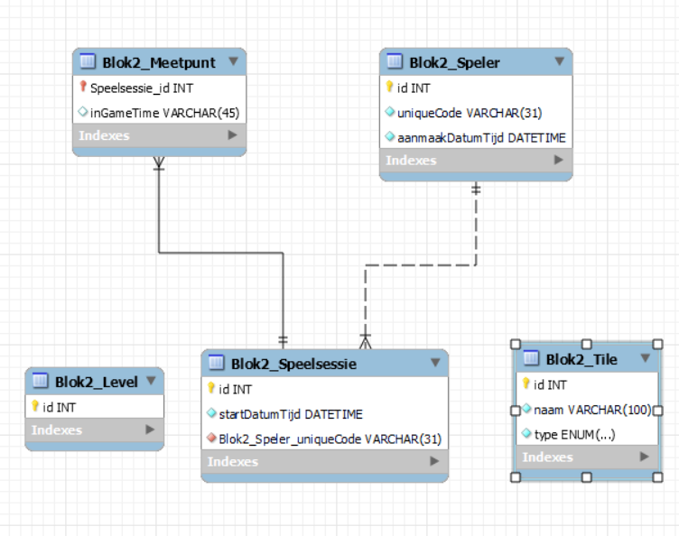
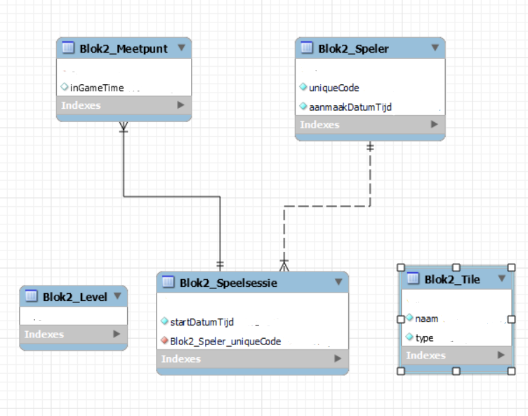
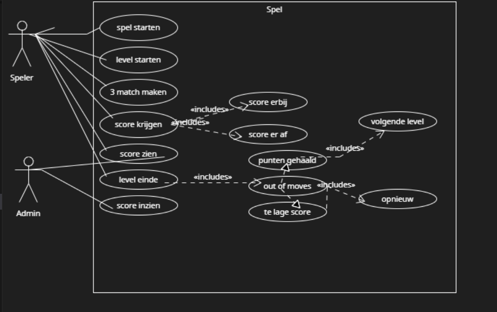

# Expert review blok 2 Sprint 3.

## K5 Je hebt object georiënteerd geprogrammeerd en maak gebruik van objectgeoriënteerde technieken zoals abstraction, inheritance en encapsulation. 

Tijn:


Abstraction:

Abstraction is het verbergen van code die een gebruiker niet hoeft te snappen, in een makkelijk begrijpbaar iets, zoals een functie bijvoorbeeld. Wij hebben abstraction gebruikt om processen als het verwisselen van tiles en doorgaan naar het volgende level, enorm eenvoudig te maken om opnieuw te gebruiken. Neem bijvoorbeeld deze functie:

    ```javascript
    // Add a function to move to the next level
    goToNextLevel() {
        switchScreen(2);
        this.#generateTileGrid();

        if (this.currentLevel < TileGrid.levels.length && this.levelCompleted) {
            this.currentLevel++;
            this.startLevelValueCheck();
            this.#generateTileGrid();
        } else {
            // Handle game completion or loop back to the first level
            // For now, let's loop back to the first level
            this.currentLevel = 1;
            this.startLevelValueCheck();
            this.#generateTileGrid();
        }
        this.setLevelIndex(this.currentLevel)
    }
    ```

Deze functie zorgt ervoor dat alle logica om naar een volgend level te gaan, heel eenvoudig onder 1 functie staat. Dit maakt het gemakkelijk om de goToNextLevel functie te gebruiken, elke keer als de speler een level haalt. Het is makkelijk te gebruiken, en scheelt regels code als de functie vaker gebruikt wordt.

    ```javascript
    swapTiles(x1, y1, x2, y2) {
        const isAdjacentX = (x1 === x2) && (Math.abs(y1 - y2) === 1);
        const isAdjacentY = (y1 === y2) && (Math.abs(x1 - x2) === 1);
        if (this.#tiles[x1][y1] && this.#tiles[x2][y2]) {
            if (isAdjacentX && this.#tiles[x1][y1].tileType !== 5 && this.#tiles[x2][y2].tileType !== 5 || 
                isAdjacentY && this.#tiles[x1][y1].tileType !== 5 && this.#tiles[x2][y2].tileType !== 5) {
                let temp = this.#tiles[x1][y1];
                this.#tiles[x1][y1] = this.#tiles[x2][y2];
                this.#tiles[x2][y2] = temp;
                temp = null;
                if (this.#tiles[x1][y1] != null) {
                    this.#tiles[x1][y1].setPosition(createVector(x1, y1));
                    tileGrid.turnCounter -= 1;
                }
    
                if (this.#tiles[x2][y2] != null) {
                    this.#tiles[x2][y2].setPosition(createVector(x2, y2));
                }
            }
        }
    }
    ```

Door deze functie te maken, is de core mechanic van tiles omwisselen, vrij makkelijk te hergebruiken. Een gebruiker hoeft alleen maar de x-coordinaat en y-coordinaat van 2 tiles te weten. Vervolgens kijkt de functie of de tiles naast elkaar liggen (zo niet, dan kunnen ze ook niet omgewisseld worden), en daarna wisselt de functie beide tiles van plek, als beide tiles niet de tileType (5) bevatten van de staticTile. Ook wordt een waarde van 1 vana de turnCounter in het level afgehaald als er een verwiseling plaatsvindt.


Inheritance:

Inheritance is het overerven van bepaalde variablen en functies uit een class naar een andere class. Wij hebben voornamelijk gebruik gemaakt van inheritance om onze tile class verder uit te breiden. Zo kunnen we voor tiles die zich anders gedragen dan een 'normale' tile. Een normale tile kan zich bewegen, omwisselen, naar beneden vallen met zwaartekracht en verdwijnen als er een match is. Alleen wij hebben nog twee andere soorten tiles die wij gebruiken in ons spel. Dit zijn de static tile en de special tile. Hieronder is te zien hoe de code van de special tile en de normal tile eruit zien.

    ```javascript
    class SpecialTile extends NormalTile {
        constructor(image, size, x, y, tileType) {
            super(image, size, x, y, tileType);
        }
    }
    ```

    ```javascript
    class NormalTile extends Tile {
        constructor(image, size, x, y, tileType) {
            super(image, size, x, y, tileType);
        }
        //functions that determine if a tile is moving or not
        isDragging() {
            return this.isDragging;
        }
    
        startDragging() {
            this.isDragging = true;
        }
    
        stopDragging() {
            this.isDragging = false;
        }
    }
    ```

Zoals hier te zien is, neemt de special tile eigenlijk alle eigenschappen over van de normal tile (de normal tile is bijna identiek aan tile, behalve dan dat de normalTile de functies krijgt om te checken of een tile wordt bewogen of niet). Zo kan bij een nieuwe instance van SpecialTile, de lijn: let ... = new SpecialTile. Wij maken gebruik van de tileType om verschillende tiles van elkaar te identificeren. Het 'speciale' van de special tile is dan ook dat het minpunten geeft als je een match compleet maakt met 3 special tiles. Naast de special tile hadden we ook de static tile. Hieronder is te zien hoe de code van de static tile eruit ziet.

    ```javascript
    class StaticTile extends Tile {
        constructor(image, size, x, y, tileValue) {
            super(image, size, x, y, tileValue);
        }
    }
    ```

Zoals hier te zien neemt de static tile alles over van de tile class in plaats van de normal tile class. Hierdoor krijgt de static tile alle functies met betrekking tot beweging niet mee. Ook geven wij een andere waarde voor tileValue mee, net zoals bij de special tile.

Door het overerven van variables en functies van andere classes, kunnen de opeenvolgende classes sneller geschreven worden, zonder bepaalde logica 2x te moeten schrijven. Dit helpt om bestanden korter te maken, en deze overzichterlijker te maken voor ons.

Encapsulation:

Encapsulation is het verbergen van functies en onnodige variablen voor de gebruiker in een class. De gebruiker hoeft alleen te weten hoe de class heet, en welke variablen nodig zijn voor de constructor. Dit zorgt dat iemand een object uit een class kan maken, zonder dat deze persoon iets van de class begrijpt. Ik heb 2 classes gemaakt die van dit concept gebruik maken.

    ```javascript
    class Button {
        x;
        y;
        text;
        button;

        constructor(x, y, text, screenIndex, startsHidden) {
            this.text = text;
            this.button = createButton(text);
            this.button.position(x,y);
            if (startsHidden) {
            this.button.hide();
            }
            this.button.mousePressed(() => {
                if (tileGrid.levelCompleted) {
                    tileGrid.goToNextLevel();
                }
                switchScreen(screenIndex);
                this.button.hide();
            });
        }
    }
    ```

Dit is een class die het maken van een button, enorm makkelijk maakt. Het stopt alle logica, zoals het maken van een button, het geven van een positie en een functie die gebruikt wordt als de knop gedrukt wordt, weg in de constructor waar de gebruiker voor de rest niks mee hoeft te kunnen. Om de button te maken hoeft de gebruiker alleen maar (als voorbeeld): let exitLevel = new Button(200, 200, "exit level", 5, true) neer te zetten (5 bij screenIndex omdat dat het scherm is van de garage). Hieronder volgt de 2e class:

    ```javascript
    class Car {
        x;
        y;
        speedMultiplier;

        constructor(image, x, y) {
            this.image = image;
            this.x = x;
            this.y = y;
            this.startX = x;
            this.startY = y;
            this.speedMultiplier = width / tileGrid.pointRequirement;
            this.size = 100;
        }

        checkEndLevel() {
            if (tileGrid.levelCompleted) {
                this.hide();
            }
        }

        checkBeginLevel() {
            if (!tileGrid.levelCompleted) {
                this.show();
            }
        }

        hide() {
            this.x = -1000;
            this.y = -1000;
        }

        show() {
            this.x = this.startX;
            this.y = this.startY;
        }

        calculatePosition() {
            this.x = 400 - (score * this.speedMultiplier);
        }  
    }
    ```

Deze class maakt meer gebruik van class-eigen functies. Dit maakt het gebruik van encapsulation nog nuttiger, omdat een gebruiker heel makkelijk de functies kan aanroepen ergens anders in de code. Deze zullen dan precies doen wat er in de naam van de functie staat (zoals de auto laten zien of weglaten). De auto instancen is ook heel erg simpel. De gebruiker hoeft alleen maar coordinaten en een plaatje door te voeren in de constructor.

Rick:
(Abstraction:
Zoals Tijn hier boven al melde is Abstraction makkelijker gezegt, het verbergen van code die een gebruiker niet hoeft te snappen. Nu kan ik zijn 2 voorbeelden pakken maar ik denk dat het beter is als ik ook nog 2 voorbeelden noem.

    ```javascript
        #generateTileGrid() {
        const currentLevelGrid = TileGrid.levels[this.currentLevel - 1].grid;

        this.#tiles = new Array();

        //generate tile grid here and place tiles in the 2D #tile array.
        for (let x = 0; x < this.#width; x++) {
            for (let y = 0; y < this.#height; y++) {
                if (!this.#tiles[x]) {
                    this.#tiles[x] = new Array();
                }

                const tileValue = currentLevelGrid[x][y];

                switch (tileValue) {
                    case 1:
                        this.#tiles[x][y] = new NormalTile(gameManager.getImage("Wheel"), this.#tileSize, x, y, 1);
                        break;
                    case 2:
                        this.#tiles[x][y] = new NormalTile(gameManager.getImage("SteeringWheel"), this.#tileSize, x, y, 2);
                        break;
                    case 3:
                        this.#tiles[x][y] = new NormalTile(gameManager.getImage("JerryCan"), this.#tileSize, x, y, 3);
                        break;
                    case 4:
                        this.#tiles[x][y] = new SpecialTile(gameManager.getImage("StopSign"), this.#tileSize, x, y, 4);
                        break;
                    case 5:
                        this.#tiles[x][y] = new StaticTile(gameManager.getImage("YellowBlackSign"), this.#tileSize, x, y, 5);
                        break;
                }
            }
        }
    }
    ```
Hierboven staat een stuk code wat voor ons het mogelijk maakt om de tilegrids te maken die wij gebruiken voor elk level. deze code gebruiken wij dan ook als wij bijvoorbeeld met gemak een nieuw level willen toevoegen aan het spel. Dit zorgt er ook voor dat wij gecombineerd met de "#goToNextLevel" Functie die Tijn heeft beschreven wij makkelijk nieuwe levels kunnen implementeren in de game.

```javascript
    constructor(width, height, tileSize) {
        this.#tileSize = tileSize;
        this.#width = width;
        this.#height = height;
        this.currentLevel = 1; // Start from level 1
        this.levelCompleted = false;
        this.startLevelValueCheck();
        this.pointRequirement;
        this.turnCounter;
        this.#generateTileGrid();
        this.nextLevel = new Button(200, 200, "Continue", 2, true);
    }
```

Deze is misschien een beetje vals spelen maar door de constructor werken er veel classes met een stuk minder code dan nodig is. zo zorgt de constructor er voor dat de tiles zonder al te veel code allemaal de goede grootte krijgen en zorgt dit ervoor dat wij makkelijk turns kunnen toevoegen en weg nemen van levels.


)
(Inheritance:
 Inheritance is eigelijk het overzetten van bepaalde functies van en class om andere classes makkelijker te maken. zo is te zien in tijn zijn voorbeelden dat al onze tile classes. de tiles zijn natuurlijk allemaal tiles dus moeten ze allemaal de zelfde basis eigenschappen hebben. Laten we naar 2 andere voorbeelden kijken

 ```javascript
 
 ```

)
(Encapsulation

```javascript
class Tile {
    #x;
    #y;
    #size;
    #image;
    isDragging = false;

    get x() {
        return this.#x;
    }

    set x(value) {
        this.#x = value;
    }

    get y() {
        return this.#y;
    }

    set y(value) {
        this.#y = value;
    }

    get position() {
        return createVector(this.#x, this.#y).mult(this.#size);
    }

    setPosition(position) {
        this.#x = position.x;
        this.#y = position.y;
    }
    
    //constructor voor een tegel die het positioneren, een afbeelding en een sleep-boolean geeft
    constructor(image, size, x, y, tileType) {
        this.#image = image;
        this.#size = size;
        this.#x = x;
        this.#y = y;
        this.tileType = tileType;
    } 
```
Hierboven staat het stukje code wat voor ons de tiles maakt. deze code zorgt er voor dat als wij nog een tile willen maken. dit maakt het dan een stuk makkelijker om allemaal te coderen met locatie, grootte en welk plaatje het is dan dat wij het allemaal opnieuw moeten schrijven.

```javascript
    // Customizable levels and points needed to finish
    static levels = [
        {
            grid: [
                [0, 0, 1, 3, 2, 2],
                [0, 0, 1, 1, 3, 2],
                [0, 0, 3, 3, 1, 3],
                [0, 0, 3, 1, 3, 2],
                [0, 0, 1, 2, 1, 2],
                [0, 0, 2, 3, 1, 1],
                [0, 0, 0, 0, 0, 0]
            ],
            pointRequirement: 1000,
            turnCounter: 10
```
en ja, zelfs de tilemap is encapsulation. dit zorgt er voor dat wij zonder moeite in dit grid systeem een level kunnen maken en dit zonder moeite kunnen stoppen in andere code wat er voor zorgt dat het spel je automatisch brengt naar bijvoorbeeld een level 5 als je level 4 heb gehaald. 

)

## K6 Je hebt een genormaliseerde relationele database ontworpen en gebruikt om informatie uit je project in op te slaan, op te halen en te bewerken. 
Tijn:
Ik ga onze database relaties aantonen aan de hand van een EERD/ERD. Dit is een (Enhanced) entity-relation diagram. Dit toont de relaties aan tussen verschillende entities in een database, aan de hand van blokken van de entities, die verbonden staan met lijnen, en uiteinden van de lijnen die de relatie aantonen (bijvoorbeeld een 1 op veel relatie).



Een ERD is eigenlijk hetzelfde als een EERD, behalve dat niet belangrijke informatie voor de gebruiker, achterwege gelaten wordt, net zoals de variablesoorten van de data in de entities. Hieronder volgt de ERD van dezelfde database.



Zoals te zien is in het diagram, wordt de speler aangesloten op een meetpunt aan de hand van de speelsessie_id. Ook krijgt de speler een unieke speler_uniqueCode door een speelsessie te starten. 

Rick:
## K7 Je hebt je werk beschreven met behulp van UML-technieken
Tijn:
Ik heb een class diagram gemaakt van de gehele game, waarin verbanden en overervingen worden weergegeven, en alle attributes en methods staan bij de classes. 


Rick:
Ik heb een use case gemaakt van de game waarin je kan zien hoe de game specifiek werkt met alle functies van het spel.



