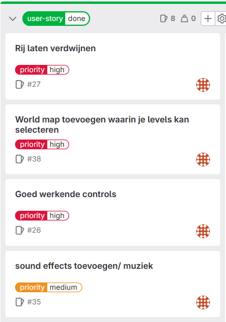
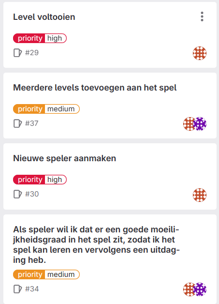
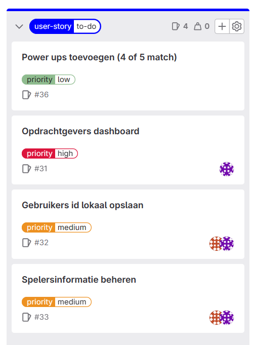
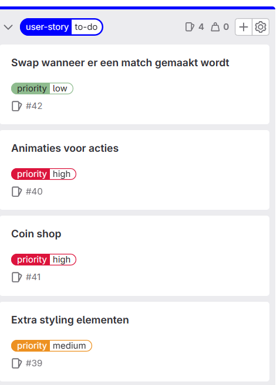

# Eerste Product review blok 2 Sprint 2.

Link voor de game:  
https://kuuyiiduugoo92-propedeuse-hbo-ict-onderwijs-2023-84efc2dba1f157.dev.hihva.nl/game/

## K1 Je hebt (een groot deel van) de user stories afgerond.
Wij hebben in sprint 3 een groot deel van de user stories alsnog kunnen afronden, zelfs toen we in sprint 2 behoorlijk achterliepen op schema.

(Rood/oranje symbooltje zijn user stories van Tijn, paars symbooltje zijn user stories van Rick).

Zoals hier te zien hebben wij geen tijd gehad om powerups toe te voegen (vanwege tijdsprioriteit). Los daarvan hebben wij moeite gehad met het correct aanroepen van de database, waarna het is mislukt om een admin panel toe te voegen, om data over de spelers op te halen en te displayen. Ondanks dit, hebben wij wel eigen user stories afgerond, zoals een soundtrack/effects, meerdere levels om te spelen, moeilijkheidsgraad op de levels, en een world map om zelf je levels te kiezen (mits deze al unlocked zijn door de speler). Al met al zijn wij blij met de progressie die wij geboekt hebben in sprint 3.

## K2 Je hebt de behoeftes van de doelgroep onderzocht en gebruikt om zelf een aantal user stories te schrijven.
Voor K4 hebben wij een gebruikerstest uitgevoerd om de behoeftes van de gebruiker in kaart te brengen. Hieruit bleken verschillende dingen:
<ul>
    <li>De gebruiker wilt extra styling in de game (zoals bijvoorbeeld rondom de knoppen of een blok van een kleurcontrast achter bepaalde stukken tekst om ze makkelijker leesbaar te maken).</li>
    <li>De gebruiker wilt combo-items als er 4/5 match wordt gevormd.</li>
    <li>De gebruiker wilt een shop om coins uit te geven.</li>
    <li>De gebruiker wilt graag animaties bij matches en vallen van tiles, om het spel overzichtelijker te maken.</li>
    <li>De gebruiker vond het meer intuitief om alleen tiles te kunnen bewegen die dan ook een match vormen.</li>
</ul>

Aan de hand van deze inzichten hebben wij enkele user stories gevormd.

<ol>
    <li>Als speler wil ik extra styling in de game, zodat bepaalde elementen beter te lezen zijn, of zodat het thema meer cohesie heeft.</li>
    <li>Als speler wil ik dat ik combo-items kan verkrijgen als ik een 4/5 match maak, zodat er meer diepgang in de levels zit. (Deze hadden wij al toegevoegd aan de hand van sprint 2, maar is niet doorgekomen vanwege prioriteiten).</li>
    <li>Als speler wil ik een plek om mijn coins te kunnen spenderen, zodat ik het gevoel heb dat ik controle heb over mijn spel.</li>
    <li>Als speler wil ik dat er animaties zijn bij verschillende acties in het spel, zodat ik een overzichtelijk beeld krijg van wat er allemaal gebeurd op het scherm.</li>
    <li>Als speler wil ik dat tiles alleen bewogen kunnen worden als er een match wordt gemaakt, zodat ik niet per ongeluk een zet verspil.</li>
</ol>

Dit is het overzicht van de user stories die wij hebben toegevoegd aan sprint 4, aan de hand van de gebruikerstest.

## K3 Je hebt de gebruikersinterface van jouw product aangepast door prototyping toe te passen.
Wij hebben ons in sprint 2 voorgenomen, om zo snel mogelijk een basis te leggen voor ons spel. Dat betekende voor ons: matches kunnen gecheckt worden, gematchde tiles worden verwijderd, tiles kunnen naar beneden vallen als er geen tile onder zich zit en nieuwe tiles kunnen inspawnen als er geen tile aanwezig is op de bovenste rij. Dit hebben wij in een redelijke tijd af kunnen werken, dus zijn wij toen begonnen aan ons tweede actiepunt: meerdere levels creeeren, en dan ook de criteria om een level te halen/te falen. Wij hebben uiteindelijk 5 levels kunnen toevoegen, met een oplopende moeilijkheid. Ook is het ons daarna gelukt om een wens van de gebruiker te kunnen realiseren; het systeem van een world map. Door terug naar de garage te kunnen gaan om je totale aantal coins te kunnen zien en om een level te selecteren (die al unlocked is), is dit geworden zoals de gebruiker die deze feature had gewilt, in gedachten had.  

## K4 Je hebt een testplan geschreven en gebruikt om een gebruikerstest uit te voeren. 
Wij hebben een testplan geschreven voor een gebruikerstest, zodat wij inzicht krijgen in wat een speler van ons spel wilt en verwacht. Wij hebben ervoor gekozen om de vragen specifiek te stellen over bepaalde features van ons spel, zodat wij de problemen die de gebruiker heeft, direct kunnen aanpakken.

Testplan:
<ul>
    <li>Wat is je naam, en hoe oud ben je?</li>
    <li>Wat vind je van het openingsscherm en de garage?</li>
    <li>Je mag nu het spel spelen (max een paar minuten, afhankelijk van de persoon). Probeer zoveel mogelijk overhard te denken.</li>
    <li>Wat vond je van de layout van de levels (waar staat alles op het scherm)?</li>
    <li>Wat vond je van de beweging van de tiles?</li>
    <li>Wat vond je van het matchen van de tiles?</li>
    <li>Wat vond je van het win/verliesscherm?</li>
    <li>Wat vond je van de soundtrack die wij hebben toegevoegd?</li>
    <li>Heb je nog punten waar je vastliep/gefrustreerd werd?</li>
    <li>Heb je nog extra feedback die niet in een van de vorige kopjes past?</li>
    <li>Zou je nog extra features willen zien in een volgende versie van het spel?</li>
</ul>

Dit testplan hebben wij vervolgens ingevuld aan de hand van drie testpersonen. Deze vallen alle 3 binnen de doelgroep (16-26 jaar oud).

Wat is je naam, en hoe oud ben je?
<ul>
    <li>-Lennon, 21</li>
    <li>-Youri, 17</li>
    <li>-Trishul, 17</li>
</ul>

Wat vind je van het openingsscherm en de garage?
<ul>
    <li>-Geeft goed het thema weer van het spel, de stijl van het spel is duidelijk.</li>
    <li>-Level knop placement is goed, coin counter staat een beetje random.</li>
    <li>-Helemaal prachtig, heel creatief.</li>
</ul>

Je mag nu het spel spelen (max een paar minuten, afhankelijk van de persoon). Probeer zoveel mogelijk overhard te denken.

Wat vond je van de layout van de levels (waar staat alles op het scherm)?
<ul>
    <li>-Goede verdeling, boven alle info en beneden de grid.</li>
    <li>-Wel goed te zien, alleen geef de tekst een soort achtergrond voor opvallendheid.</li>
    <li>-Heel overzichtelijk, duidelijk.</li>
</ul>

Wat vond je van de beweging van de tiles?
<ul>
    <li>-Tiles wisselen was duidelijk, maar de vallende tiles gaan te snel, niet duidelijk te zien waar ze heen gaan.</li>
    <li>-Beweging is goed, alleen houd het wel bij beweging als er een match gemaakt wordt (dus niet vrij bewegen).</li>
    <li>-Geleidelijk, prettig voor het oog.</li>
</ul>

Wat vond je van het matchen van de tiles?
<ul>
    <li>-De match die je zelf maakt is goed te zien, maar de rest van de matches zijn moeilijk te zien ivm snelheid.</li>
    <li>-Matchen zelf is prima, alleen animatie toevoegen bij het naar beneden vallen.</li>
    <li>-Het werkt goed, en meteen. Je kan makkelijk zien wanneer tiles matchen.</li>
</ul>

Wat vond je van het win/verliesscherm?
<ul>
    <li>-Handig om de coins die verdiend zijn, weer te geven op het eindscherm. Verder goed.</li>
    <li>-Scherm is duidelijk, alleen als het spel gehaald is, moet dat wel duidelijk.</li>
    <li>-Overzichtelijk.</li>
</ul>

Wat vond je van de soundtrack die wij hebben toegevoegd?
<ul>
    <li>-Goed en passend. Inspirerend en emotioneel.</li>
    <li>-Goed nummer, chill nummer maar wel genoeg spanning.</li>
    <li>-10/10, echt heel goed en maakt het spel leuker om te spelen.</li>
</ul>

Heb je nog punten waar je vastliep/gefrustreerd werd?
<ul>
    <li>-Nee.</li>
    <li>-Het eindscherm werkte niet.</li>
    <li>-Nee.</li>
</ul>

Heb je nog extra feedback die niet in een van de vorige kopjes past?
<ul>
    <li>-De knoppen kunnen styling gebruiken.</li>
    <li>-Grotere en langere levels, met hogere scorevereisten en extra zetten. Voor hogere combo's van matches zou een powerup/extra effect fijn zijn.</li>
    <li>-De tiles reageren te snel. Valanimatie en matchanimate/sfx zou fijn zijn.</li>
</ul>

Zou je nog extra features willen zien in een volgende versie van het spel?
<ul>
    <li>-Shop voor coins.</li>
    <li>-Combo-items voor extra diepte.</li>
    <li>-Dingen kopen met coins, en pauzemenu in het level.</li>
</ul>
 

Wij hebben de gebruikerstest op verschillende manier afgenomen. Bij Lennon was het eenvoudig. Hij zit bij ons in de klas dus we konden het aan hem vragen na de les om de game te proberen en vragen te beantwoorden. Voor Trishul en Youri heeft Tijn een discord call gestart, en heeft van hieruit het testplan afgenomen. Hoewel dit minder persoonlijke antwoorden oplevert (zoals gezichtsuitdrukkingen tijdens het testen), hebben wij hier alsnog een paar belangrijke inzichten uit verkregen.

Wij hebben na dit gebruikersonderzoek een paar user stories geschreven aan de hand van de feedback/ideeen van de testpersonen. Deze laten wij zien in K2.

Nogmaals link voor de game:  
https://kuuyiiduugoo92-propedeuse-hbo-ict-onderwijs-2023-84efc2dba1f157.dev.hihva.nl/game/