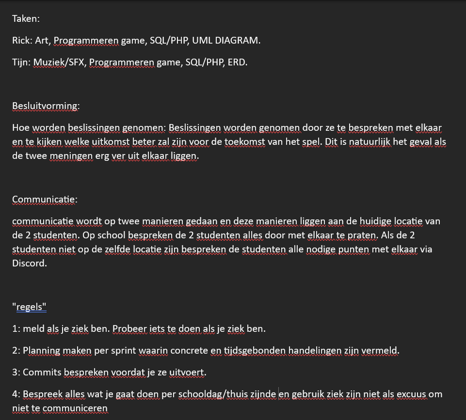

# Retrospective blok 2 Sprint 3.
In deze retrospective kijken we terug op de persoonlijke ontwikkeling, samenwerking en kwaliteit van het werk uit sprint 3.

## G1: Persoonlijke ontwikkeling.

### Je neemt verantwoordelijkheid voor je eigen handelen. Je aanvaardt consequenties van jouw gedrag. Je werkt resultaat gericht aan je opdracht of taak. Je hebt een actieve werkhouding. Je leert van en met elkaar en bent aanwezig op contactmomenten. Je herkent waar je leerbehoeftes zitten en stelt doelen op om deze te vervullen. Je reflecteert op je handelen en je evalueert je doelen.

### Je geeft op constructieve manier feedback aan medestudenten en ontvangt feedback. Je geeft aan hoe je die feedback gaat gebruiken.

## G4: Je werkt volgens (gegeven) kwaliteitsnormen

### Je werkt volgens de agile methodiek van HBO-ICT

## G5: Je kan constructief samenwerken in een duo

### Samenwerkingscontract

### Wat doen wij als de samenwerking niet lekker verloopt?

Als de samenwerking niet goed verloopt, dan bespreken wij onze moeilijkheden en/of punten van kritiek met elkaar. Van hieruit proberen wij tot een concensus te komen, waar wij allebei weer mee overweg kunnen. Hiervan leren wij van elkaar, en zal onze samenwerking erop vooruitgaan.

### Verwachting van duopartner

### Feedback aan duopartner