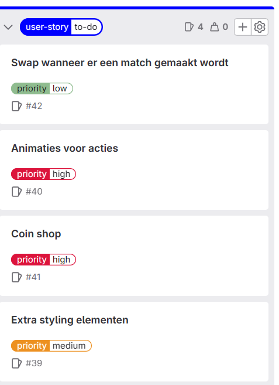

# Retrospective blok 2 Sprint 3.
In deze retrospective kijken we terug op de persoonlijke ontwikkeling, samenwerking en kwaliteit van het werk uit sprint 3.

## G1: Persoonlijke ontwikkeling.

### Je neemt verantwoordelijkheid voor je eigen handelen. Je aanvaardt consequenties van jouw gedrag. Je werkt resultaat gericht aan je opdracht of taak. Je hebt een actieve werkhouding. Je leert van en met elkaar en bent aanwezig op contactmomenten. Je herkent waar je leerbehoeftes zitten en stelt doelen op om deze te vervullen. Je reflecteert op je handelen en je evalueert je doelen.

Tijn: Ik had aan het begin van sprint 3 actiepunten gesteld om mijn programmeervaardigheden te verbeteren. Dit waren het begrijpen van scope in JavaScript, het correct gebruiken van variables en functies in classes en een spoedcursus SQL om de database op te zetten. Ik heb hiervan uiteindelijk de scope en de variablen/functies in classes onder de loep genomen, en heb dit ook kunnen snappen over de kerstvakantie heen. Het doel was om op de technische kant van het project te focusen, en hierop veel achterstanden in te halen. Ik had bijvoorbeeld voor sprint 3 nog geen enkele nieuwe class gemaakt en uitgeschreven. In sprint 3 heb ik 2 volledig functionele classes weten te maken, die wij nuttig konden gebruiken in de code. Daarnaast hebben wij qua front-end, een functionerend 3-match spel in elkaar weten te bouwen, voornamelijk gemaakt in sprint 3. Ik ben goed disciplineerd te werk gegaan en dat is ook te zien in het product. Wij hebben wel moeite gehad op het gebied van de back-end, en dit is dus ook heel minimaal in onze game verwerkt. Voor een toekomstige opdracht met een back-end zou ik mij verdiepen in php/sql om te begrijpen wat er allemaal gebeurd, en hier ook aanpassingen in te maken om dit werkzaam te krijgen. Dit zou ik gaan doen aan de hand van een codecademy cursus over back-end en php/sql.

### Je geeft op constructieve manier feedback aan medestudenten en ontvangt feedback. Je geeft aan hoe je die feedback gaat gebruiken.

Tijn: Gijs en Lennon hadden voor hun gebruikersonderzoek nog mensen nodig om hun gebruikerstest in te vullen, dus ik stelde mij hiervoor vrijwillig. Zij hadden een vrij open testplan gebruikt, dat ze mij het spel lieten spelen, en dan dat ik mijn gedachten overhard zou zeggen. Het was moeilijk om veel feedback te vinden, want zij hadden een enorm goed spel in elkaar gezet. Ik had een paar UI-kritiekpunten. Dit waren bijvoorbeeld: Het zou voor de gebruiker fijn zijn om te zien hoe het pad precies loopt op de minimap (stippellijn van level naar level, of het pad afblokkeren waar je niet heen kan). Daarnaast was het in het level lastig te zien wat er bij sommige powerups gebeurde, dus een tutorial of overzichtelijke UI zou helpen met de spelerservaring. Los daarvan had ik geen op of aanmerkingen. Wij hebben zelf ook een gebruikersonderzoek uitgevoerd, waar wij ook feedback hebben ontvangen. Deze feedback hebben wij omgezet in user stories voor een (niet bestaande) sprint 4. Hieronder is een overzicht te zien van de toegevoegde user stories:  

## G4: Je werkt volgens (gegeven) kwaliteitsnormen

### Je werkt volgens de agile methodiek van HBO-ICT

## G5: Je kan constructief samenwerken in een duo

### Samenwerkingscontract

### Wat doen wij als de samenwerking niet lekker verloopt?

Als de samenwerking niet goed verloopt, dan bespreken wij onze moeilijkheden en/of punten van kritiek met elkaar. Van hieruit proberen wij tot een concensus te komen, waar wij allebei weer mee overweg kunnen. Hiervan leren wij van elkaar, en zal onze samenwerking erop vooruitgaan.

### Verwachting van duopartner

### Feedback aan duopartner