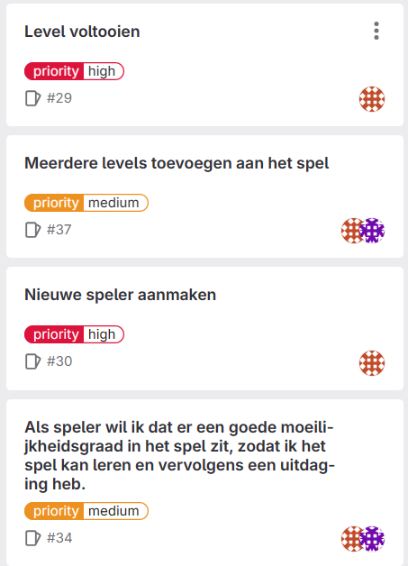

# Retrospective blok 2 Sprint 3.
In deze retrospective kijken we terug op de persoonlijke ontwikkeling, samenwerking en kwaliteit van het werk uit sprint 3.

## G1: Persoonlijke ontwikkeling.

### Je neemt verantwoordelijkheid voor je eigen handelen. Je aanvaardt consequenties van jouw gedrag. Je werkt resultaat gericht aan je opdracht of taak. Je hebt een actieve werkhouding. Je leert van en met elkaar en bent aanwezig op contactmomenten. Je herkent waar je leerbehoeftes zitten en stelt doelen op om deze te vervullen. Je reflecteert op je handelen en je evalueert je doelen.
Tijn: Ik had aan het begin van sprint 3 actiepunten gesteld om mijn programmeervaardigheden te verbeteren. Dit waren het begrijpen van scope in JavaScript, het correct gebruiken van variables en functies in classes en een spoedcursus SQL om de database op te zetten. Ik heb hiervan uiteindelijk de scope en de variablen/functies in classes onder de loep genomen, en heb dit ook kunnen snappen over de kerstvakantie heen. Het doel was om op de technische kant van het project te focusen, en hierop veel achterstanden in te halen. Ik had bijvoorbeeld voor sprint 3 nog geen enkele nieuwe class gemaakt en uitgeschreven. In sprint 3 heb ik 2 volledig functionele classes weten te maken, die wij nuttig konden gebruiken in de code. Daarnaast hebben wij qua front-end, een functionerend 3-match spel in elkaar weten te bouwen, voornamelijk gemaakt in sprint 3. Ik ben goed disciplineerd te werk gegaan en dat is ook te zien in het product. Wij hebben wel moeite gehad op het gebied van de back-end, en dit is dus ook heel minimaal in onze game verwerkt. Voor een toekomstige opdracht met een back-end zou ik mij verdiepen in php/sql om te begrijpen wat er allemaal gebeurd, en hier ook aanpassingen in te maken om dit werkzaam te krijgen. Dit zou ik gaan doen aan de hand van een codecademy cursus over back-end en php/sql.

### Je geeft op constructieve manier feedback aan medestudenten en ontvangt feedback. Je geeft aan hoe je die feedback gaat gebruiken.
Tijn: Gijs en Lennon hadden voor hun gebruikersonderzoek nog mensen nodig om hun gebruikerstest in te vullen, dus ik stelde mij hiervoor vrijwillig. Zij hadden een vrij open testplan gebruikt, dat ze mij het spel lieten spelen, en dan dat ik mijn gedachten overhard zou zeggen. Het was moeilijk om veel feedback te vinden, want zij hadden een enorm goed spel in elkaar gezet. Ik had een paar UI-kritiekpunten. Dit waren bijvoorbeeld: Het zou voor de gebruiker fijn zijn om te zien hoe het pad precies loopt op de minimap (stippellijn van level naar level, of het pad afblokkeren waar je niet heen kan). Daarnaast was het in het level lastig te zien wat er bij sommige powerups gebeurde, dus een tutorial of overzichtelijke UI zou helpen met de spelerservaring. Los daarvan had ik geen op of aanmerkingen. Wij hebben zelf ook een gebruikersonderzoek uitgevoerd, waar wij ook feedback hebben ontvangen. Deze feedback hebben wij omgezet in user stories voor een (niet bestaande) sprint 4. Hieronder is een overzicht te zien van de toegevoegde user stories:<br><br>


## G4: Je werkt volgens (gegeven) kwaliteitsnormen

### Je werkt volgens de agile methodiek van HBO-ICT
De agile methodiek houdt in dat het werk wendbaar wordt gecreeerd zodat er nog aanpassingen in het proces kunnen worden gemaakt. Op deze school wordt gebruik gemaakt van de agile methode SCRUM. Met scrum wordt een project opgedeeld in (ongeveer gelijke) periodes, die srpints genoemd worden. Aan het einde van een sprint wordt gekeken naar het project en de werkwijze, waarna hierop aanpassingen gemaakt kunnen worden. Dit zorgt voor een soepel proces, waarbij een project op correcte manier zijn eindstadium kan halen. Aan het begin van de sprint wordt gekeken naar wat haalbaar lijkt voor de tijdsperiode die gegeven is. Aan het einde van de sprint wordt alles wat niet gehaald is, direct meegenomen naar volgende sprint.





Zoals te zien in de plaatjes hierboven, is er deze sprint gewerkt met een issue board om progressie bij te houden. In deze sprint is veel progressie geboekt als het gaat om user stories. Wij hebben deze sprint 8 user stories af weten te ronden (hierbij zijn de user stories met oranje plaatje van Tijn, en met het paarse plaatje van Rick). De user stories die wij niet hebben afgemaakt, worden meegenomen naar een volgende sprint. 

Het laatste onderwerp van de scrum-methode is de product review en de retrospective (het bestand wat nu gelezen word). In de product review wordt gekeken naar een testbaar product, zodat hier realistische feedback om gegeven kan worden. Het was onze laatste product review van dit blok, maar we moesten alsnog feedback meenemen naar de volgende sprint (die er niet is). De product review is zeer goed ontvangen, waarbij wij 6 criteria op niveau hebben gescoord. Wij hebben als feedback hieruit meegenomen, dat het product nog een tutorial kan gebruiken, en het feit dat er een groot deel van de back-end mist. Maar het gehele product was enorm goed, vond Engelbert (onze waardeerder).

### Je code voldoet aan de Google coding conventions
Tijn: Voor onze coding conventions kijken we naar een paar conventions die wij hanteren. Dit zijn:
- Naming conventions; dit helpt met het makkelijker begrijpen waar een variable, function of class voor dient. 
- Line length conventions: dit helpt met het makkelijker leesbaar maken van lange regels code, door de regel op te splitsen over verschillende regels of variablenamen korter te maken.
- Comments; deze helpen met het uitleggen wat een gecondenseerd stukje code doet, zodat teamsgenoten gemakkelijk begrijpen wat iemand anders van het team met een bepaald stukje code wilt bereiken.
- Indentation; deze helpt met een structuur geven aan een codeblok (zoals een if-statement). Hierdoor is het gemakkelijk om te bepalen wat er allemaal onder een statement valt.

Hieronder volgt een nieuwe class die ik geschreven heb, waarin wij deze conventions hanteren:

```javascript
class Car {
    x;
    y;
    speedMultiplier;

    constructor(image, x, y) {
        this.image = image;
        this.x = x;
        this.y = y;
        this.startLevelX = x;
        this.startLevelY = y;
        this.speedMultiplier = width / tileGrid.scoreRequirement;
        this.size = 100;
    }

    //hides car when level ends
    checkEndLevel() {
        if (tileGrid.levelCompleted) {
            this.hide();
        }
    }

    //shows car when level begins
    checkBeginLevel() {
        if (!tileGrid.levelCompleted) {
            this.show()
        }
    }

    //hides the car from the player
    hide() {
        this.x = -1000;
        this.y = -1000;
    }

    //shows the car to the player
    show() {
        this.x = this.startX;
        this.y = this.startY;
    }

    //moves the car based on the score achieved by the player and the level the player is on
    calculatePosition() {
        this.speedMultiplier = width / tileGrid.scoreRequirement;
        this.x = 400 - (score * this.speedMultiplier);
    }  
}
```

Om de naming conventions aan te tonen kijken we naar de speedMultiplier variable en een variable uit een ander script, tileGrid.scoreRequirement. De speedMultiplier dient om de snelheid van de auto de veranderen op basis van de scoreRequirement van het level, zodat de auto op het scherm altijd op het scherm blijft (tenzij het level is gehaald, maar dat is de bedoeling). Dit word in het kort verteld aan de hand van de variablenamen. Zo kan een nieuwe gebruiker gemakkelijk begrijpen waarvoor bepaalde variablen gebruikt worden.

Voor de line length convention is het belangrijk dat een programmeur niet naar links en rechts hoeft te scrollen om de code te zien. Daar is in dit script geen sprake van, en de code is mooi leesbaar op een lijn.

Er zijn comments toegevoegd bij elke functie van de Car class, zodat makkelijk te zien is waar een functie voor dient. Bijvoorbeeld dat de calculatePosition() bedoeld is om de positie te berekenen aan de hand van de score en de scoreRequirement.

Indentation wordt hier gebruikt om makkelijk te zien welke regels code zich in een functie bevinden. Hier hebben wij gebruik van gemaakt in elke functie, waardoor het makkelijker te lezen is.

### Je code is technisch gedocumenteerd en relevant voor collega's
Tijn: voor de technische documentatie pak ik een andere class die ik in elkaar heb gezet deze sprint; de button class.

```javascript
class Button {
    x;
    y;
    text;
    button;

    constructor(x, y, text, buttonScreenIndex, startsHidden, currentLevel) {
        this.text = text;
        this.button = createButton(text);
        this.button.position(x,y);
        if (startsHidden) {
            this.button.hide();
        }
        //all the logic when a button is pressed
        this.button.mousePressed(() => {
            //sends player to next level if continue button is pressed
            if (tileGrid.currentLevel == 5 && screenIndex === 3) {
                tileGrid.goToNextLevel();
                return;
            }
            if (tileGrid.levelCompleted && x > 250) {
                tileGrid.goToNextLevel();
            //checks if player completed a level and went back to the garage, and then updates the highest level beaten accordingly
            } else if (tileGrid.levelCompleted && x < 250) {
                tileGrid.levelCompleted = false;
                if (tileGrid.highestLevelBeaten <= tileGrid.currentLevel) {
                tileGrid.highestLevelBeaten++;
                }
                tileGrid.currentLevel = tileGrid.highestLevelBeaten;
            }
            //sends player to the level that is displayed on the button with the currentLevel variable given with the constructor
            if (screenIndex === 5) {
                tileGrid.currentLevel = currentLevel;
            }
            //starts the main theme when the second screen is entered
            if (screenIndex === 0) {
                mainMenuTheme.setVolume(0.3, 0)
                playSong(mainMenuTheme);
            }
            //resets level when any button is pressed, and switches screen to the buttonScreenIndex assigned with the constructor
            //also makes sure all buttons hide after being pressed
            tileGrid.resetLevel();
            switchScreen(buttonScreenIndex);
            score = 0;
            this.button.hide();
        });
    }
}
```

Ik ben begonnen met een aantal variablen mee te geven aan de button. De x/y-positie (int), een tekst (string) en het feit dat het een button is (zodat gebruik gemaakt kan worden van de createButton functie van p5.js). Daarna roepen wij de constructor aan, waarin een x/y-positie meegegeven wordt, en ook nog een tekst, de screenIndex van waar de button je naartoe neemt, een boolean of de button onzichtbaar is als hij aangemaakt wordt en een current level. Deze wordt maar aan sommige knoppen meegegeven, waardoor bepaalde knoppen je naar bepaalde levels kunnen sturen (bijvoorbeeld de level 4 knop, zet je currentLevel naar level 4). Hierna wordt een button aangemaakt met de text als tekst op de button, op positie x en y die meegegeven zijn, daarna wordt de button verstopt als hij startsHidden = true als property heeft. Vervolgens worden verschillende dingen gecheckt als een knop wordt gedrukt. Laten we dit aanpakken per if-statement.

```javascript
//sends player to next level if continue button is pressed
if (tileGrid.currentLevel == 5 && screenIndex === 3) {
    tileGrid.goToNextLevel();
    return;
}
```

Als de speler op het laatste level (5) is, en op het winscherm is na het level, dan wordt de speler naar een winscherm verstuurt. Dit gebeurd in de goToNextLevel(), maar de return zorgt ervoor dat er niks raars gebeurd hierna.

```javascript
if (tileGrid.levelCompleted && x > 250) {
    tileGrid.goToNextLevel();
//checks if player completed a level and went back to the garage, and then updates the highest level beaten accordingly
} else if (tileGrid.levelCompleted && x < 250) {
    tileGrid.levelCompleted = false;
    if (tileGrid.highestLevelBeaten <= tileGrid.currentLevel) {
    tileGrid.highestLevelBeaten++;
    }
    tileGrid.currentLevel = tileGrid.highestLevelBeaten;
}
```

Als de speler een level heeft gehaald en de button bevindt zich aan de rechterkant van het scherm (in onze game is dat de continue button), dan wordt de speler naar het volgende level gestuurd. Als de button aan de linkerkant van het scherm zit (in onze game is dit de back to garage button), dan wordt bepaald dat de speler het level niet meer heeft gehaald. Hierna wordt gecheckt of de speler een level heeft gespeeld die niet gelijk staat aan het hoogste level wat de speler heeft gehaald. Is dit het geval, dan wordt het hoogste level niet geupdate. Anders gaat de waarde van het hoogste level omhoog met 1. Hierdoor kan de speler oudere levels opnieuw spelen zonder problemen.

```javascript
//sends player to the level that is displayed on the button with the currentLevel variable given with the constructor
if (screenIndex === 5) {
    tileGrid.currentLevel = currentLevel;
}
```

Als de speler zich bevindt in de garage (screenIndex === 5), en de speler drukt op een button, dan wordt de current level gezet naar de current level waarde die in de constructor is meegegeven aan de button

```javascript
//starts the main theme when the second screen is entered
if (screenIndex === 0) {
    mainMenuTheme.setVolume(0.3, 0)
    playSong(mainMenuTheme);
}
```

Als de speler zich bevindt op het beginscherm (screenIndex === 0), en de speler drukt op een button (dit is een startknop), dan start het muziekje van het spel.

```javascript
//resets level when any button is pressed, and switches screen to the buttonScreenIndex assigned with the constructor
//also makes sure all buttons hide after being pressed
tileGrid.resetLevel();
switchScreen(buttonScreenIndex);
score = 0;
this.button.hide();
```

Na elke button press wordt het level gereset, wordt het scherm aangepast naar de buttonScreenIndex die is meegegeven in de constructor, wordt de score naar 0 gezet en verdwijnt de knop van het scherm.

### Je communiceert professioneel en gestructureerd
Tijn: Voor communicatie tussen mij en Rick hebben wij exclusief gebruik gemaakt van Discord. Dit is een (video)chatplatform, waarmee gemakkelijk foto's en video's kunnen worden. Ook kunnen videooproepen gestart worden, en scherm delen is ook een optie. Daarnaast heb ik met leraren zo formeel mogelijk gecommuniceerd. Ook probeer ik mijn feedback zo construcief mogelijk te verwoorden, en wordt kritiek met open armen ontvangen, aangezien ik hierdoor kan groeien als persoon en als programmeur.

## G5: Je kan constructief samenwerken in een duo

### Samenwerkingscontract


### Wat doen wij als de samenwerking niet lekker verloopt?
Als de samenwerking niet goed verloopt, dan bespreken wij onze moeilijkheden en/of punten van kritiek met elkaar. Van hieruit proberen wij tot een concensus te komen, waar wij allebei weer mee overweg kunnen. Hiervan leren wij van elkaar, en zal onze samenwerking erop vooruitgaan.

### Verwachting van duopartner
Tijn: Ik verwacht van Rick dat hij doet wat hem aangewezen is in de sprintplanning. Ook verwacht ik van hem dat hij zich houdt aan alle regels omtrent het samenwerkingscontract. Daarnaast verwacht ik van hem dat hij zicht uitspreekt als dingen niet goed verlopen, zodat wij misschien samen tot een oplossing kunnen komen.

### Feedback aan duopartner
Tijn: Vorige sprint heb ik als feedback aan Rick meegegeven dat hij zich echt meer moet focusen op de code. Hoewel hij dit heeft geprobeert, is dit niet heel goed gelukt. Aangezien het blok af is, zou ik Rick voor volgend blok meegeven als feedback, om op elk onderwerp van een project te focusen (denk hierbij aan design, code, graphic design etc.), en dus niet bepaalde onderwerpen te verwaarlozen. Dit zou helpen om een well-rounded programmeur te worden. Los van dit heeft hij wel waardering voor het werk wat ik heb gedaan deze sprint, en heeft hij geholpen met zaken als playtesting en user stories schrijven uit het gebruikersonderzoek. 